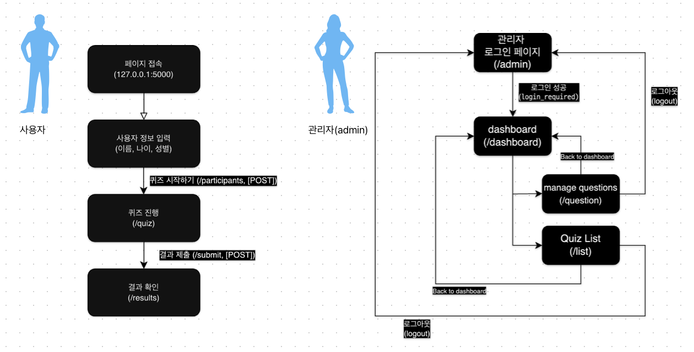

> 본 심리테스트는 5개의 문항으로 이루어져 있으며, 사용자로부터 응답(참여자 정보, 문항별 응답)을 모두 받은 뒤 통계화면을 출력함으로써 간단한 데이터 분석을 할 수 있음



# 자료구조
```
/Project
├─ db.sqlite
├─ run.py
├─ /app  
│       database.py  
│       models.py  
│       routes.py  
│       __init__.py  
│  
├─ /templates  
│      admin.html  
│      dashboard.html
│      index.html
│      manage_questions.html
│      quiz.html
│      quiz_list.html
│      results.html
```
# db.sqlite
사용자로부터 입력받은 정보들을 저장되는 DB

# run.py
`flask run` 입력 시 실행되는 프로그램

# app/database.py
Flask-SQLAlchemy 사용을 위한 인스턴스 생성

# app/models.py
DB에 저장하기 위해 모델(테이블)을 지정함
```
from .database import db
from datetime import datetime


class Participant(db.Model):
    __tablename__ = "participant"
    id = db.Column(db.Integer, primary_key=True)
    name = db.Column(db.String(50))
    age = db.Column(db.Integer)
    gender = db.Column(db.String(10))
    created_at = db.Column(db.DateTime, default=datetime.utcnow)


class Admin(db.Model):
    __tablename__ = "admin"
    id = db.Column(db.Integer, primary_key=True)
    username = db.Column(db.String(50))
    password = db.Column(db.String(50))


class Question(db.Model):
    __tablename__ = "question"
    id = db.Column(db.Integer, primary_key=True)
    content = db.Column(db.String(255))
    order_num = db.Column(db.Integer, default=0)  
    is_active = db.Column(db.Boolean, default=True)


class Quiz(db.Model):
    __tablename__ = "quiz"
    id = db.Column(db.Integer, primary_key=True)
    participant_id = db.Column(db.Integer, db.ForeignKey("participant.id"))
    question_id = db.Column(db.Integer, db.ForeignKey("question.id"))
    chosen_answer = db.Column(db.String(255))

    participant = db.relationship("Participant", backref="quizzes")
    question = db.relationship("Question", backref="quizzes")
```


### 1. Participant (참가자)
### 2. Admin (관리자)
### 3. Question (질문지)
### 4. Quiz (질문에 대한 응답)
---
# app/routes.py
flask-Blueprint 를 이용해 route를 설정함

`main route`, `admin route` 로 나누어짐

## `main route`
* `127.0.0.1:5000/`
```
@main.route("/", methods=["GET"])
def home():
    # 참여자 정보 입력 페이지를 렌더링합니다.
    return render_template("index.html")
```
해당 주소로 접속 시 templates 폴더의 index.html 이 나타남


---
* `127.0.0.1:5000/participants`
```
@main.route("/participants", methods=["POST"])
def add_participant():
    data = request.get_json()
    new_participant = Participant(
        name=data["name"], age=data["age"], gender=data["gender"] , created_at=datetime.utcnow()
    )
    db.session.add(new_participant)
    db.session.commit()

    # 리다이렉션 URL과 참여자 ID를 JSON 응답으로 전송
    return jsonify(
        {"redirect": url_for("main.quiz"), "participant_id": new_participant.id}
    )
```
사용자로부터 이름, 나이, 성별, 참여시간(실시간) 을 입력받아 json 형태로 DB에 저장함

이후 저장된 new_participant.id를 돌려보내며 사용자에게는 `127.0.0.1:5000/quiz` 로 넘어가게 함


---
* `127.0.0.1:5000/quiz`
```
@main.route("/quiz")
def quiz():
    # 퀴즈 페이지를 렌더링합니다. 참여자 ID 쿠키가 필요합니다.
    participant_id = request.cookies.get("participant_id")
    if not participant_id:
        # 참여자 ID가 없으면, 홈페이지로 리다이렉션합니다.
        return redirect(url_for("main.home"))

    questions = Question.query.all()
    questions_list = [question.content for question in questions]
    return render_template("quiz.html", questions=questions_list)
```
이 전 `participants` 으로부터 받아온 `participants.id` 를 조회하여 유효한 사용자인지 확인 후,  
DB의 `Question` 에서 질문을 모두 가져온 뒤 페이지(`quiz.html`)에 나타냄

* `127.0.0.1:5000/submit`
```
@main.route("/submit", methods=["POST"])
def submit():
    # 참여자 ID가 필요합니다.
    participant_id = request.cookies.get("participant_id")
    if not participant_id:
        return jsonify({"error": "Participant ID not found"}), 400

    data = request.json
    quizzes = data.get("quizzes", [])

    for quiz in quizzes:
        question_id = quiz.get("question_id")
        chosen_answer = quiz.get("chosen_answer")

        # 새 Quiz 인스턴스 생성
        new_quiz_entry = Quiz(
            participant_id=participant_id,
            question_id=question_id,
            chosen_answer=chosen_answer,
        )
        # 데이터베이스에 추가
        db.session.add(new_quiz_entry)

    # 변경 사항 커밋
    db.session.commit()
    return jsonify(
        {
            "message": "Quiz answers submitted successfully.",
            "redirect": url_for("main.show_results"),
        }
    )
```
응답의 id, 사용자 id, 사용자로부터 입력된 응답들이 json 형태로 DB에 전송(저장)됨

* `127.0.0.1:5000/questions`
```
@main.route("/questions")
def get_questions():
    # is_active가 True인 질문만 선택하고, order_num에 따라 정렬
    questions = (
        Question.query.filter(Question.is_active == True)
        .order_by(Question.order_num)
        .all()
    )
    questions_list = [
        {
            "id": question.id,
            "content": question.content,
            "order_num": question.order_num,
        }
        for question in questions
    ]
    return jsonify(questions=questions_list)
```
DB의 `Question` 에서 is_active가 True 인 경우만 order_num에 따라 정렬하여 json 형태로 전송함

* `127.0.0.1:5000/results`

DB에서 데이터를 조회하여 시각화함


## `admin route`
* `127.0.0.1:5000/admin`
```
@admin.route("", methods=["GET", "POST"])
def login():
    if request.method == "POST":
        username = request.form["username"]
        password = request.form["password"]

        admin = Admin.query.filter_by(username=username).first()

        if admin and check_password_hash(admin.password, password):
            session["admin_logged_in"] = True
            return redirect(url_for("admin.dashboard"))
        else:
            flash("Invalid username or password")

    return render_template("admin.html")
```

`admin.html` 을 이용하여 사용자로부터 정보(계정)를 입력받음

사용자로부터 요청받은 username이 admin 계정 DB에 있는지 조회함

있다면 templates 폴더의 dashboard.html이 나타남  
없다면 오류 메세지를 띄움

* `127.0.0.1:5000/logout`
```
@admin.route("/logout")
def logout():
    session.pop("admin_logged_in", None)
    return redirect(url_for("admin.login"))
```

사용자 세션에서 "admin_logged_in" 을 지우고 `127.0.0.1:5000/login` 으로 돌아가게 함

* `'login_required'`
```
def login_required(f):
    @wraps(f)
    def decorated_function(*args, **kwargs):
        if "admin_logged_in" not in session:
            return redirect(url_for("admin.login", next=request.url))
        return f(*args, **kwargs)

    return decorated_function
```
`login_required` 함수를  데코레이터로 정의하여, `127.0.0.1:5000/admin/dashboard`, `127.0.0.1:5000/admin/dashboard/question`, `127.0.0.1:5000/admin/dashboard/list` 라우터에는 데코레이터를 활용하여 admin 계정 로그인이 필요하게끔 하였음

* `127.0.0.1:5000/admin/dashboard`

DB에 저장된 키(key)의 관계를 활용하여 여러가지의 데이터를 나타내고 있음

날짜별 참가자 수, 날짜와 참가자 수를 분리하여 리스트로 할당 후 그래프로 표현함

* `127.0.0.1:5000/admin/dashboard/question`

`manage_question()` 함수를 정의하여 질문을 추가, 수정할 수 있게 함

* `127.0.0.1:5000/admin/dashboard/list`

사용자들의 질문 별 답변들을 DB로부터 불러와서 모두 나타나게 함 

# 사용된 라이브러리
### 1. Python 3.12
### 2. Flask 3.0.3
백엔드 API, 웹 페이지 개발을 지원함
### 3. Flask-SQLAlchemy 3.1.1
Python에서 ORM 방식으로 DB CURD를 할 수 있도록 함
### 4. Flask-Migrate
DB 버전 관리 및 Flask app이 DB에 접근 시 변경사항 등을 반영할수 있도록 함
### 5. pandas, plotly
DB의 데이터를 시각화 함

